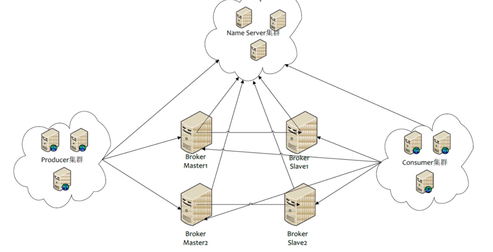

# 核心概念

- NameServer：可以理解为一个注册中心，主要是用来保存topic路由信息，管理Broker。在NameServer的集群中，NameServer与NameServer之间是没有任何通信的。
- Broker：核心的一个角色，主要是用来保存topic的信息，接受生产者生产的消息，持久化消息。在一个Broker集群中，相同的BrokerName可以称为一个Broker组，一个Broker组中，BrokerId为0的为主节点，其它的为从节点。BrokerName和BrokerId是可以在Broker启动时通过配置文件配置的。每个Broker组中只存放一部分信息。
- 生产者：生产消息的一方的就是生产者
- 生产者组：一个生产者组可以有很多生产者，只需要在创建生产者的时候指定生产者组，那么这个生产者就在那个生产者组
- 消费者：用来消费生产者消息的一方
- 消费者组：跟生产者一样，每个消费者都有所在的消费者组，一个消费者组可以放很多的消费者，不同的消费者组消费消息是互不影响的。
- topic（主题）：可以理解为一个消息的集合的名字，生产者在发送消息的时候需要指定发送到哪个topic下，消费者消费消息的时候也需要知道自己消费的是哪些topic底下的消息。
- Tag（子主题）：比topic低一级，可以用来区分同一topic下的不同业务类型的消息，发送消息的时候也需要指定。

这里有组的概念是因为可以用来做到不同的生产者组或者消费者组有不同的配置，这样就可以使得生产者或者消费者更加灵活。

# 工作流程

说完核心概念，再看下核心工作流程，下图是rocketMq主要组件的工作原理图



通过这张图可以清楚知道，大致工作原理：

- Broker启动的时候，会往每台NameServer（因为NameServer之间不通信，所以每台都得注册）注册自己的信息，这些信息包括自己的ip和端口号，自己这台Broker有哪些topic等信息。
- Producer在启动之后会跟NameServer建立连接，定期从NameServer中获取Broker的信息，当发送消息的时候，会根据消息需要发送到哪个topic去找对应的Broker地址，如果有的话，就向这台Broker发送请求；如果没有找到的话，则根据是否配置了自动创建topic来决定是否发送消息。
- Broker在接收到Producer的消息之后，会将消息存起来，持久化，如果有从节点的话，也会主动同步给从节点，实现数据的备份
- Consumer启动之后也会跟NameServer建立联系，定期从NameServer中获取Broker和对应topic的消息，然后根据自己需要订阅的topic信息找到对应的Broker的地址，然后跟Broker建立连接，获取消息，进行消费

## 总体来讲：

**NameServer的职责：管理Broker，举例：各个邮局的管理机构**
**Broker的职责：接收消息，存储消息，举例：邮局**
**Producer的职责：向Broker发送消息，首先要询问NameServer，要一个Broker地址，举例：发信者**
**Consumer的职责：消费Broker的消息，首先要询问NameServer，要一个Broker地址，举例：收信者**
**Topic：区分消息的种类；一个发送者可以发送消息给一个或者多个Topic；一个消息的接收者可以订阅一个或者多个Topic消息**
**Message Queue：相当于是Topic的分区；用于并行发送和接收消息**

# 集群搭建方式

## NameServer集群

集群中的各个NameServer节点是无状态的，每一个节点的信息都是一样的，节点之间是不通信的，主要就是管理着Broker的信息。
Broker启动的时候，会给每一个NameServer节点上报自己的信息，这样每一个NameServer节点都会有一份Broker的信息，这样就可以实现负载均衡。
节点之间的数据是没有差异的，所以可以随意的增加或者减少节点。

## Broker集群

分为Master和Slave，Master是主节点，Slave是从节点，主节点负责消息的写操作，从节点负责消息的读操作。
同一组的Master和Slave是一对多的关系，一个slave只能对应一个master，一个master可以对应多个slave。
Master与Slave的对应关系通过指定相同的BrokerName和不同的BrokerId来实现的，BrokerName是Broker的名字，
BrokerId是Broker的唯一标识，BrokerName和BrokerId是可以在启动Broker的时候通过配置文件来配置的。
是通过BrokerId来区分的，BrokerId为0的是Master，其它的是Slave，比如BrokerName为broker-a，那么broker-a-0就是Master，broker-a-1就是Slave。
每个Broker与NameServer建立长连接，定时注册Topic信息到所有NameServer，定时发送心跳包到所有NameServer，以及定时从所有NameServer拉取Topic信息。

## Producer和Consumer集群

节点之间是可以通信的，所以Producer和Consumer也是可以集群的，Producer和Consumer集群的目的是为了提高系统的吞吐量，降低延迟，提高可用性。
Producer与NameServer集群中的其中一个节点（随机选择）建立长连接，定时从NameServer获取Topic路由信息，并向提供Topic服务的Master、Slave建立长连接，且定时向Broker发送心跳包，Producer完全无状态，可集群部署。
Consumer与NameServer集群中的其中一个节点（随机选择）建立长连接，定期从NameServer取Topic路由信息，并向提供Topic服务的Master、Slave节点建立长连接，且定时向Master、Slave发送心跳。
Consumer既可以从Master订阅消息，也可以从Slave订阅消息，订阅规则由Broker配置决定，Consumer也是无状态，可集群部署。
# Docker方式启动命令

ps: Apple Silicon M1版本的芯片，docker方式启动会有问题，建议用常规压缩包方式安装启动。

``` bash
# 拉取镜像
docker pull rocketmqinc/rocketmq
# 创建一个文件夹用于存放相关文件
mkdir rocketMqAtHome01 && cd rocketMqAtHome01
# 创建namesrv数据卷文件夹
mkdir -p data/namesrv/logs data/namesrv/store
# 构建namesrv容器
docker run -d \
--restart=always \
--name namesrvAtHome01 \
-p 9876:9876 \
-v /Users/ivan/dockerV/rocketMqAtHome01/data/namesrv/logs:/root/logs \
-v /Users/ivan/dockerV/rocketMqAtHome01/data/store:/root/store \
-e "MAX_POSSIBLE_HEAP=100000000" \
rocketmqinc/rocketmq \
sh mqnamesrv
# -e "MAX_POSSIBLE_HEAP=100000000"
# 设置最大堆内存为100000000
# 创建broker数据卷文件夹以及配置文件
mkdir -p data/broker/logs data/broker/store conf
vi broker.conf
brokerClusterName = DefaultCluster
brokerName = broker-a
brokerId = 0
deleteWhen = 04
fileReservedTime = 48
brokerRole = ASYNC_MASTER
flushDiskType = ASYNC_FLUSH
brokerIP1 = 192.168.14.124 本机ip

# 构建broker容器
docker run -d \
--restart=always \
--name brokerAtHome01 \
--link namesrvAtHome01:namesrv \
-p 10911:10911 \
-p 10909:10909 \
-v /Users/ivan/dockerV/rocketMqAtHome01/data/broker/logs:/root/logs \
-v /Users/ivan/dockerV/rocketMqAtHome01/data/broker/store:/root/store \
-v /Users/ivan/dockerV/rocketMqAtHome01/conf/broker.conf:/opt/rocketmq-4.4.0/conf/broker.conf \
-e "NAMESRV_ADDR=namesrvAtHome01:9876" \
-e "MAX_POSSIBLE_HEAP=200000000" \
rocketmqinc/rocketmq \
sh mqbroker -c /opt/rocketmq-4.4.0/conf/broker.conf
```

# 常规方式环境搭建

讲完了简单的概述，一起动手搭建一套RokcetMQ环境。

通过上面分析，我们知道，在RocketMQ中有NameServer、Broker、Producer、Consumer四个角色。而生产者和消费者其实就是业务系统，所以这里不需要搭建，真正搭建的就是NameServer和Broker，但是为了方便RocketMQ数据的可视化，这是多搭建了一套可视化的服务。

搭建的过程比较简单，如果过程中报错一些命令不存在，直接通过yum安装这些命令就行。

## 一、准备

需要准备一个Linux环境，需要安装好JDK

关闭防火墙

``` bash
systemctl stop firewalld
systemctl disable firewalld
```

**下载并解压RocketMQ**

下载

``` bash
wget https:``//archive``.apache.org``/dist/rocketmq/4``.7.1``/rocketmq-all-4``.7.1-bin-release.zip

unzip rocketmq-all-4.7.1-bin-release.zip
```

或者在官网进行下载

解压后进入文件夹，内容如下：


## 二、搭建NameServer

**修改JVM参数**

在启动NameServer之前，强烈建议修改一下启动时的JVM参数，因为默认的参数都比较大，为了避免内存不够，建议改小，当然，如果你的内存足够大，可以忽略。

``` bash
vim bin/runserver.sh
```


将其中的参数修改为

``` bash
-server -Xms512m -Xmx512m -Xmn256m -XX:MetaspaceSize=32m -XX:MaxMetaspaceSize=50m
```

### 启动NameServer

修改完之后，执行如下命令就可以启动NameServer了

``` bash
nohup sh bin/mqnamesrv &
```

查看NameServer日志

``` bash
tail -f ~/logs/rocketmqlogs/namesrv.log
```

### 启动Broker

``` bash
nohup sh bin/mqbroker -n 192.168.31.68:9876 &
```

### 查看启动进程

``` bash
jps
```

### 测试消息生产者和消费者

``` bash
# 指定当前NAMESRV地址
%export NAMESRV_ADDR='192.168.31.68:9876'
# 执行生产者测试脚本
./tools.sh org.apache.rocketmq.example.quickstart.Producer
# 执行完成后会自动退出

# 执行消费者测试脚本
./tools.sh org.apache.rocketmq.example.quickstart.Consumer
# 执行完后会挂起，不会退出
```

### 关闭mq服务

``` bash
sh bin/mqshutdown broker
# The mqbroker(52819) is running...
# Send shutdown request to mqbroker(52819) OK
sh bin/mqshutdown namesrv
# The mqnamesrv(52660) is running...
# Send shutdown request to mqnamesrv(52660) OK
```

## 三、搭建DashBoard

``` bash

# 拉取可视化界面镜像
docker pull apacherocketmq/rocketmq-dashboard:latest
# 构建rocketmq-console容器
docker run -d \
--restart=always \
--name mqAdminAtHome01 \
-e "JAVA_OPTS=-Drocketmq.namesrv.addr=192.168.43.144:9876" \
-p 9999:8080 \
pangliang/rocketmq-console-ng
# 如果像我一样是Apple Silicon M1，或者docker启动报错platform不匹配，可以尝试如下方式：
https://github.com/apache/rocketmq-dashboard/releases/tag/rocketmq-dashboard-1.0.0
mvn clean package -Dmaven.test.skip=true
nohup java -jar -Drocketmq.namesrv.addr=127.0.0.1:9876 rocketmq-dashboard-1.0.0.jar &
来这里下载源码，然后maven编译打包，启动jar包，即可访问
```

# 代码实战

多说无益，直接进入实战

## 消息发送

### 同步发送

#### 介绍

等待消息返回后再继续进行下面的操作，有返回值。

#### 适用场景

1. 可靠性要求高
2. 数据量级较少
3. 实时响应

``` java
/**
 * 同步发送
 */
public class SyncProducer {
    public static void main(String[] args) throws MQClientException, MQBrokerException, RemotingException, InterruptedException {
        // 初始化一个DefaultMQProducer
        DefaultMQProducer producer = new DefaultMQProducer("SyncProducer");
        // 设置NameServer地址
        producer.setNamesrvAddr("192.168.31.68:9876");
        // 启动producer
        producer.start();
        // 创建消息对象，指定Topic、Tag和消息体
        Message message = new Message();
        message.setTopic("TopicTestAAA");
        message.setBody("Hello RocketMQ, This is a sync message.".getBytes(StandardCharsets.UTF_8));
        // 发送消息并获取发送结果
        SendResult send = producer.send(message);
        System.out.println("send = " + send);
        // 关闭producer
        producer.shutdown();


    }
}

```

### 异步发送

#### 介绍

不等待消息返回直接进入后续流程，broker将结果返回后调用callback函数，并使用CountDownLatch计数。

#### 适用场景

1. 适用于流量峰值较高的场景，如电商系统，减小系统压力，提高吞吐量。


``` java
/**
 * 异步发送
 */
public class AsyncProducer {
    public static void main(String[] args) throws MQClientException, RemotingException, InterruptedException {
        DefaultMQProducer producer = new DefaultMQProducer("AsyncProducer");
        producer.setNamesrvAddr("192.168.31.68:9876");
        producer.start();
        Message message = new Message();
        message.setTopic("TopicTestAAA");
        message.setBody("Hello RocketMQ, This is a async message.".getBytes(StandardCharsets.UTF_8));
        CountDownLatch countDownLatch = new CountDownLatch(1);
        producer.send(message, new SendCallback() {
            @Override
            public void onSuccess(SendResult sendResult) {
                System.out.println("sendResult = " + sendResult);
                countDownLatch.countDown();
            }

            @Override
            public void onException(Throwable throwable) {
                System.out.println("throwable = " + throwable);
                countDownLatch.countDown();
            }
        });
        countDownLatch.await();
        producer.shutdown();
    }
}

```

### 单向发送

#### 介绍

只负责发送，不管消息是否发送成功。

#### 适用场景

1. 可靠性要求不高的场景，如日志收集

``` java
/**
 * 单向发送
 */
public class OneWayProducer {
    public static void main(String[] args) throws MQClientException, RemotingException, InterruptedException {
        // 初始化一个DefaultMQProducer
        DefaultMQProducer producer = new DefaultMQProducer("OneWayProducer");
        // 设置NameServer地址
        producer.setNamesrvAddr("192.168.31.68:9876");
        // 启动producer
        producer.start();
        // 创建消息对象，指定Topic、Tag和消息体
        Message message = new Message();
        message.setTopic("TopicTestAAA");
        message.setBody("Hello RocketMQ, This is a one way message.".getBytes());
        // 发送单向消息，没有任何返回结果
        producer.sendOneway(message);
        // 关闭producer
        producer.shutdown();
    }
}
```

## 消息消费

消费者消费消息分两种：

- 推模式：消费者等待Broker把消息推送过来
- 拉模式：消费者主动去Broker上拉取消息

 ### 推模式

``` java
/**
 * 简单消费者
 */
public class Consumer {
    public static void main(String[] args) throws MQClientException {
        // 初始化一个DefaultMQPushConsumer
        DefaultMQPushConsumer consumer = new DefaultMQPushConsumer("SyncProducer");
        // 设置NameServer地址
        consumer.setNamesrvAddr("192.168.31.68:9876");
        // 订阅一个Topic，可以使用Tag来过滤需要消费的消息，这里暂时不做过滤
        consumer.subscribe("TopicTestAAA", "*");
        // 注册回调实现类来处理从broker拉取回来的消息
        consumer.setMessageListener((MessageListenerConcurrently) (list, consumeConcurrentlyContext) -> {
            // 打印消息
            list.forEach(e -> System.out.println(new String(e.getBody())));
            // 返回消费状态
            return ConsumeConcurrentlyStatus.CONSUME_SUCCESS;
        });
        // 启动consumer
        consumer.start();
        // 等待消费结束
        System.out.println("Consumer Started.");
    }
}
```

### 拉模式


